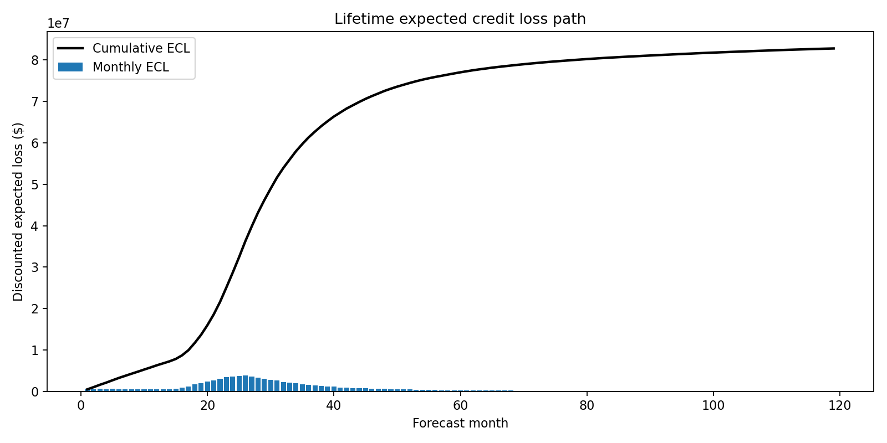

# Milestone 6 results

At the 2018-12-01 reporting date, modeled portfolio lifetime ECL is
**$82,808,294**, or **1.673%** of **$4,950,178,750** outstanding. The forecast
contains 114 score-band/vintage cells and 119 future monthly macro observations.

## PD / EAD / LGD decomposition by score band

`Expected default exposure` is `sum(marginal PD * projected EAD)`; PD is the
opening-balance-weighted cumulative probability of entering ChargeOff. The CSV
artifacts also report EAD at default as a percentage of opening exposure and
retain unrounded values.

| Score band | Balance ($M) | Lifetime PD | Expected default exposure ($M) | LGD | Lifetime ECL ($M) | ECL / balance |
|---|---:|---:|---:|---:|---:|---:|
| FICO 000-619 | 157.4 | 36.80% | 53.7 | 31.88% | 15.0 | 9.52% |
| FICO 620-659 | 489.1 | 15.20% | 69.2 | 29.48% | 17.9 | 3.66% |
| FICO 660-699 | 1,124.8 | 9.51% | 99.1 | 26.61% | 23.1 | 2.05% |
| FICO 700-739 | 1,431.2 | 5.86% | 77.8 | 23.73% | 16.1 | 1.13% |
| FICO 740-779 | 1,077.4 | 3.52% | 35.3 | 23.40% | 7.2 | 0.67% |
| FICO 780-850 | 670.2 | 2.74% | 17.2 | 22.83% | 3.5 | 0.52% |

Complete decompositions are available [by score band](ecl_by_score_band.csv)
and [by annual vintage](ecl_by_vintage.csv). More recent vintages generally
carry higher ECL rates because more contractual exposure and forecast life
remain at the cutoff; this is a remaining-life effect, not an era-level constant
LGD assumption.

## Monthly loss path

The underlying values are in the [monthly loss path](ecl_monthly_loss_path.csv),
including monthly and cumulative discounted loss and expected default exposure.

## LGD macro validation

The model uses HPI at default, not origination vintage. The era table is a
validation grouping that demonstrates the macro-conditioned predictions recover
the observed severity differences.

| Origination era | Defaults | Average HPI YoY | Realized LGD | Modeled LGD |
|---|---:|---:|---:|---:|
| Pre-2008 | 483 | 3.72% | 25.14% | 25.22% |
| 2008-2010 | 159 | 4.38% | 23.65% | 24.47% |
| 2011+ | 793 | 1.94% | 26.67% | 26.45% |

All six score bands had sufficient observed defaults, so none used the 45%
fallback. See the [era validation](lgd_validation_by_era.csv) and
[LGD coefficients](lgd_coefficients.csv) for exact values.

## Reconciliation to the M4 chain ladder

M4 projects **$93.66M** of ultimate loss, compared with M6 lifetime ECL of
**$82.81M**, a **$10.85M lower** M6 result. The direction is reasonable: M4
includes loss already realized plus projected future loss for existing cohorts
and does not discount, whereas M6 begins at the reporting date, includes only
future expected loss on surviving exposure, and discounts that loss. Their rates
use different denominators: M4 is 0.856% of $10.95B original cohort balance;
M6 is 1.673% of the $4.95B still outstanding. M6 also responds to the projected
macro path in both transition PD and LGD, while the chain ladder extrapolates
historical development. The [reconciliation table](ecl_chain_ladder_reconciliation.csv)
records both scopes explicitly.

## Verification

The hand-computed three-loan/four-month test agrees exactly at $55.6725. Tests
also cover mass conservation over a macro grid, monotone cumulative default,
balance-weighted aggregation, competing-risk prepayment, macro-conditioned LGD,
sparse-data fallback logging, censored exposure, and exact zero ECL when PD is
zero. The final command results are recorded in the implementation handoff.
