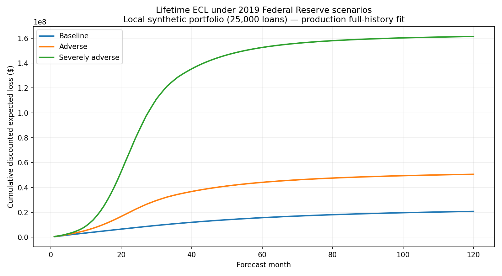

# Milestone 7 — Federal Reserve scenario results

All amounts and figures in this milestone cover the **25,000-loan local
synthetic portfolio**, restricted to the 8,927 loans observed active at the
2018-12 allowance cutoff. Opening outstanding balance is $3.616 billion. These
are not results from the 250,000-loan EMR scale run.

## Results

The production full-history transition fit and macro-conditioned LGD fit were
run over the three Federal Reserve 2019 supervisory scenarios. LGD is evaluated
at each forecast month's scenario HPI change; it is not held at a portfolio
average.

| Scenario | Lifetime ECL | ECL / outstanding | Change vs baseline |
|---|---:|---:|---:|
| Baseline | $20.75M | 0.57% | — |
| Adverse | $50.57M | 1.40% | +$29.83M / +143.76% |
| Severely adverse | $161.34M | 4.46% | +$140.59M / +677.65% |

Current→DPD30 drives the largest increase in cumulative expected state flow
under severely adverse: +$1.046 billion of exposure-weighted flow versus
baseline. DPD30→DPD60 (+$0.986B), DPD60→DPD90 (+$0.840B), and the later
delinquency rolls follow it, so the result is an economically coherent migration
through the delinquency chain rather than a direct Current→ChargeOff jump. Flow
dollars accumulate repeated monthly movements and therefore are an attribution
diagnostic, not an additive reconciliation to ECL dollars.

The auditable outputs are the [scenario summary](m7_scenario_summary.csv),
[monthly loss paths](m7_monthly_loss_paths.csv), [model-ready macro paths](m7_macro_paths.csv),
[transition attribution](m7_transition_attribution.csv), and
[extrapolation diagnostic](m7_extrapolation.csv). Every CSV carries the
portfolio scope as its first field.

## Published source and transformation

The source is the Federal Reserve's **2019 supervisory scenario vintage**, the
vintage aligned to the 2018-12 reporting cutoff. The Fed published baseline,
adverse, and severely adverse paths from 2019Q1 through 2022Q1 (13 quarters) in
[Appendix A: Supervisory Scenarios](https://www.federalreserve.gov/publications/june-2019-appendix-a-supervisory-scenarios.htm),
with scenario design described in the
[February 2019 supervisory scenarios](https://www.federalreserve.gov/publications/2019-february-supervisory-scenarios.htm).
The checked-in [source table](../data/scenarios/fed_2019_supervisory_scenarios.csv)
preserves those published values and source URL.

- The published quarterly unemployment rate is treated as a quarterly average
  and repeated for each of the quarter's three months.
- `unemployment_change_3m` is the monthly unemployment level less its level
  three months earlier. Observed 2018 local macro history bridges the first lag
  values into the scenario window.
- The published HPI index is transformed to `HPI[t] / HPI[t-4 quarters] - 1`.
  The Fed's four 2018 historical HPI anchors provide the first scenario-year
  denominators; each quarterly year-over-year change is repeated over its three
  months.

The loader validates a stable five-column contract—vintage, scenario, quarter,
unemployment, and HPI—so a later published Fed CSV can replace the configured
source without changes to forecast code.

## Reversion beyond the published window

Lifetime ECL extends beyond 2022Q1. Beginning in 2022-04, unemployment and HPI
year-over-year growth independently revert exponentially toward 4.8% and 3.0%,
respectively, with an eight-quarter half-life. In month `n` after the published
window, a variable is `long_run + (last_published - long_run) * 0.5 ** (n / 24)`.
This is a transparent engine assumption, not a Federal Reserve projection. It
is configured in `config/base.yaml`; the output flags every month as published
or reverted.

## Extrapolation and model limitations

| Scenario | Published months > 7.25% | Published months > 9.86% | Peak unemployment |
|---|---:|---:|---:|
| Baseline | 0.0% | 0.0% | 4.1% published (4.73% over lifetime reversion) |
| Adverse | 0.0% | 0.0% | 7.0% |
| Severely adverse | 84.6% | 15.4% | 10.0% |

The severely-adverse **stress region** lies outside the cutoff-clean estimation
range: 33 of its 39 published months exceed the 7.25% pre-cutoff maximum. It is
not literally true that every month exceeds that bound—the first six do not—so
the measured fraction is reported rather than replacing it with that stronger
claim. Six published months also exceed the production full-history maximum of
9.86%. Over the full 120-month path including reversion, the corresponding
fractions are 40.0% and 5.0%.

Accordingly, the severely-adverse ECL is materially an extrapolation of the
fitted macro response. Its uncertainty is not captured by the $161.34M point
estimate. The logistic form supplies a number outside observed support, but the
point estimate should not be read as evidence that its slope or curvature is
validated there; a production stress-use decision requires overlays, bounds,
or challenger evidence.

These scenario allowances use the **production full-history transition fit**,
which is appropriate for a forward-looking allowance because all available
outcomes inform estimation. The cutoff-clean fit is reserved for the M6
out-of-sample backtest and is not substituted into production scenario ECL.
